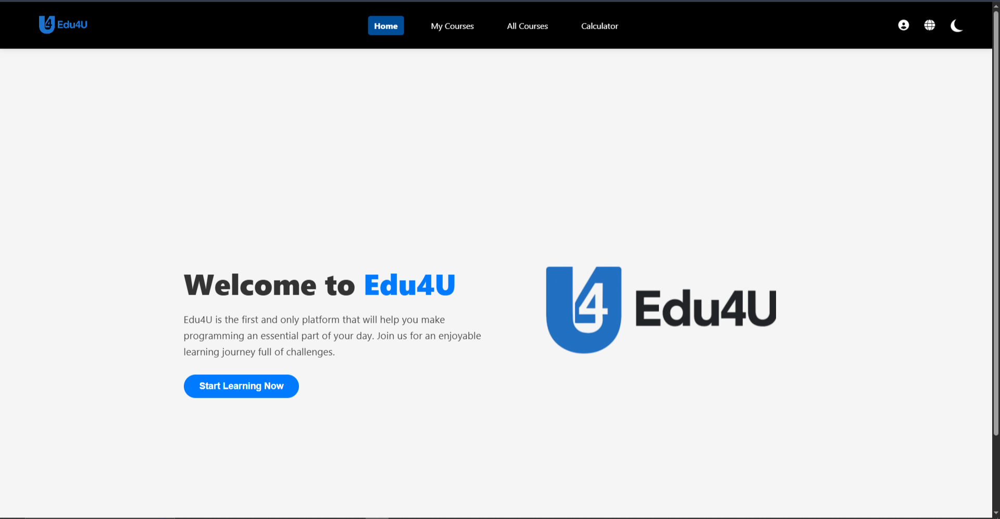
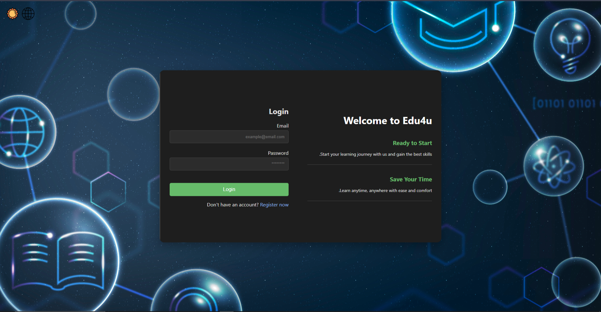
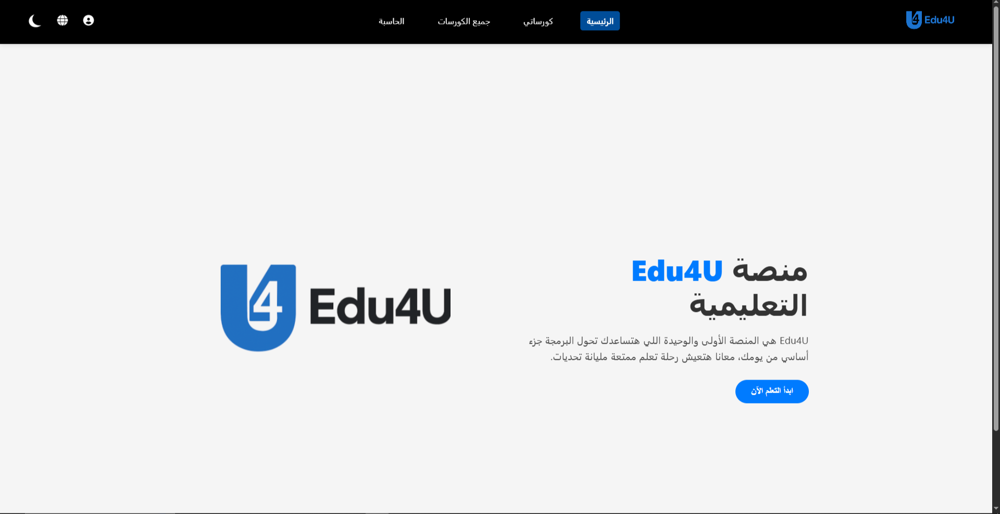

<div align="center">
  
# 🎓 Edu4U Web Platform

### Modern Educational Website with Authentication, Courses & User Experience System


 


A full-stack educational web platform developed as a university team project at Modern Academy.

</div>

---

# 📖 About The Project

Edu4U is a modern educational web platform designed to simulate a real Learning Management System (LMS).

The system provides users with authentication features, course browsing, personal course management, and profile customization. It also includes user interface enhancements such as Dark/Light mode switching and bilingual support (Arabic and English).

The project was developed as part of a university assignment, with a strong focus on frontend design, user experience, and backend integration using PHP and MySQL. 

---

# ✨ Key Features

## 🔐 Authentication System 
- Login system
- Sign up system
- Secure logout

## 📚 Course System
- Courses page
- Free courses system
- My Courses dashboard

## 👤 User System
- User profile management
- Edit name, email, and password

## 🎨 UI/UX Features
- Dark / Light mode toggle 🌗
- Arabic / English language switching 🌍
- Responsive layout design

## 🧮 Extra Features
- Built-in calculator
- Smooth navigation system

---

# 🛠 Technologies Used

| Technology | Purpose |
|------------|---------|
| HTML5 | Structure |
| CSS3 | Styling |
| JavaScript | Interactivity |
| PHP | Backend Logic |
| MySQL | Database |
| XAMPP | Local Server |

---

# 🗄️ Database Setup

- Install XAMPP
- Start **Apache** & **MySQL**
- Open **phpMyAdmin**
- Create a database named **edu4u**
- Import the SQL file:

<div align="center">

## `database/edu4u.sql`

</div>

---

## 🚀 How to Run

1. Install XAMPP  
2. Move project to `htdocs`  
3. Start Apache & MySQL  
4. Open browser:

```text
http://localhost/Edu4U
```

---

# 📸 Screenshots

## 🌞 Light Mode

<p align="center">
  
  
</p>

---

## 🌙 Dark Mode

<p align="center">
  
  
</p>

---

## 🌍 Language Versions

### 🇪🇬 Arabic

<p align="center">
  
</p>

### 🇺🇸 English

<p align="center">
  
</p>

---

# 👨‍💻 My Contribution

This was a **team project (4 members).**

### My Role

- Developed all frontend pages.
- Designed the complete UI/UX.
- Implemented the Dark/Light mode system.
- Built the Arabic/English language switching system.
- Designed the Profile page UI.
- Developed the built-in calculator.

---

# 📌 Future Improvements

- Admin Dashboard
- Payment System Integration
- Real Video Course Platform
- Certificate Generation
- Database Performance Optimization
- Mobile Application

---

# 📄 Project Report

A detailed documentation of the **Edu4U** web platform, including the system architecture, database design, user interface, and implementation details, is available below.

The report covers:

- System architecture
- Database design
- Frontend & Backend integration
- Authentication system
- Course management
- User profile management
- Dark/Light mode
- Arabic & English support

<div align="center">

📄 **[Edu4U Project Report](docs/web.pdf)**

</div>

---

# 📄 Academic Information

**Course:** Web Development / Software Engineering

**Faculty:** Computer Science

**Institution:** Modern Academy

---

<div align="center">

### ⭐ If you found this project helpful, consider giving it a star!

</div>

